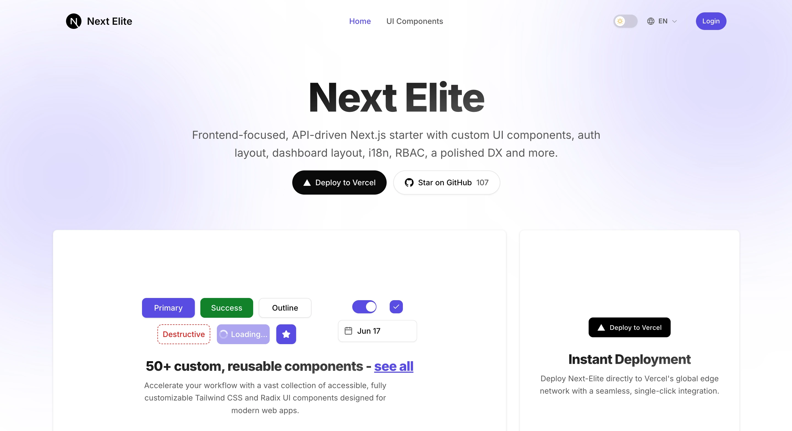
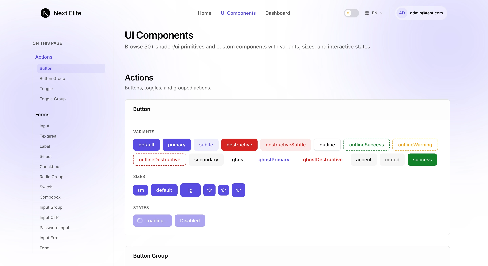
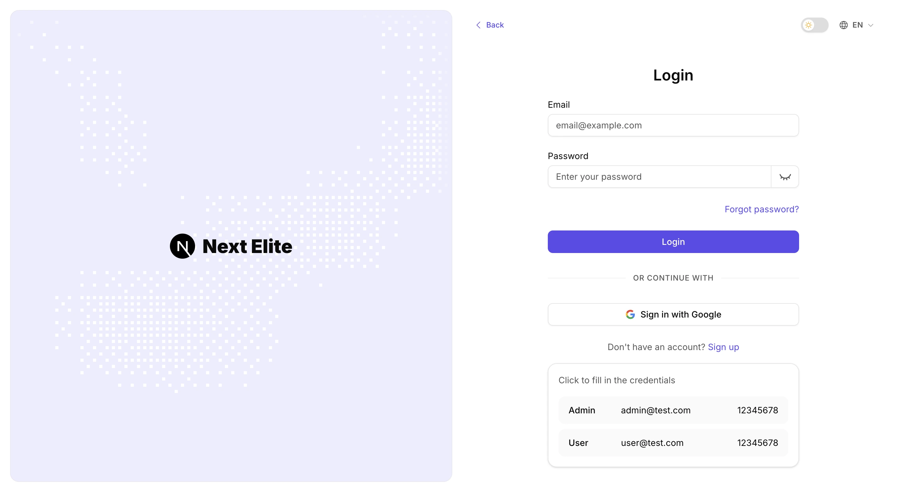
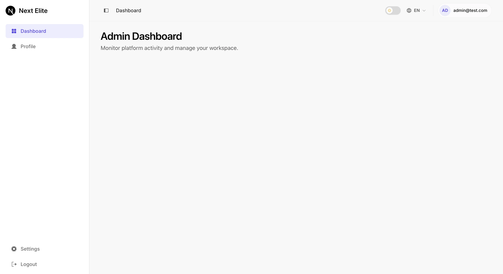
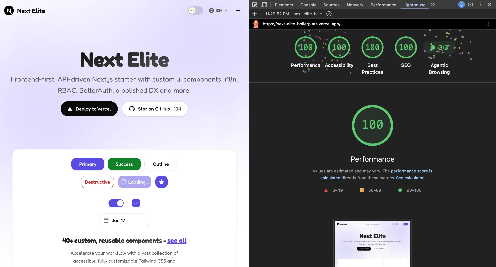
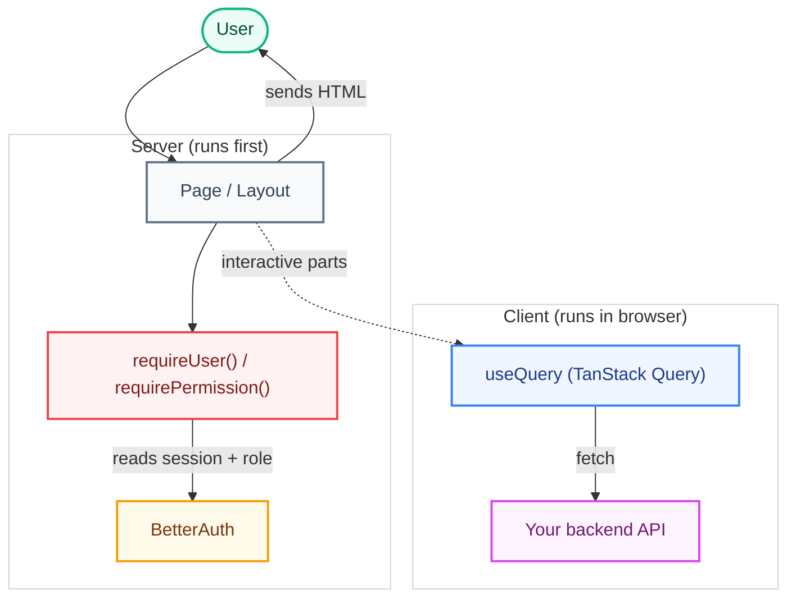

<h1 align="center">Next Elite</h1>

<p align="center">
  An open-source, frontend-first Next.js boilerplate built for an API-driven workflow, no attached database required. It's designed to consume external backends (REST, GraphQL, or BFF) while giving you a polished, production-ready starting point out of the box with pre-built auth layouts, role-based dashboard layouts, and 50+ custom & reusable UI components.
</p>

<p align="center">
  <a href="https://nextelite.salmanshahriar.com/"><strong>🚀 Live Demo</strong></a> ·
  <a href="https://github.com/salmanshahriar/Next-Elite/generate"><strong>📦 Use this Template</strong></a> ·
  <a href="https://github.com/salmanshahriar/Next-Elite/issues"><strong>🐛 Report Bug</strong></a> ·
  <a href="https://github.com/salmanshahriar/Next-Elite/issues"><strong>✨ Request Feature</strong></a>
</p>

<br/>

https://github.com/user-attachments/assets/123e879c-1d27-4781-a423-e8605505ce0a

 <br/>

<div align="center">
  <table>
    <tr>
      <td width="50%" align="center">
        <h4>Next Elite</h4>
        
      </td>
      <td width="50%" align="center">
        <h4>50+ Custom Components</h4>
        
      </td>
    </tr>
    <tr>
      <td width="50%" align="center">
        <h4>Auth Layouts</h4>
        
      </td>
      <td width="50%" align="center">
        <h4>Dashboard Layouts</h4>
        
      </td>
    </tr>
  </table>
</div>

<br/>

**Highlights & Features:**

- ⚡ **Next.js 16.3 + React 19** - Fast App Router, Turbopack, and Server Actions
- 🔥 **TypeScript 6** - End-to-end type safety across components and routes
- ✨ **Oxlint + Oxfmt** - Blazing-fast linting & formatting with Lefthook pre-commit hooks
- 🤖 **Next.js Best Practices** - Modular architecture, standalone Docker build, and performance optimizations
- 🔐 **Authentication & RBAC** - Email/Password & Google OAuth via BetterAuth with permission-based RBAC
- 🖼️ **Auth & Dashboard Layouts** - Split-pane auth layout & role-based dashboard layout with fixed sidebar navigation
- 🎨 **50+ Custom & Reusable UI Components** - Accessible shadcn/ui primitives built with Tailwind CSS v4 & Radix UI
- 📚 **Type-Safe i18n** - Cookie-based multi-language support (6 locales, LTR + RTL) powered by next-intl
- 📝 **SEO & PWA Suite** - OpenGraph metadata, dynamic sitemap, robots.txt, and web manifest
- 🧪 **Comprehensive Testing** - Unit/component testing with Vitest and E2E testing with Playwright

<br/>

## 🚀 One-click Deploy to Vercel

[](https://vercel.com/new/clone?repository-url=https://github.com/salmanshahriar/Next-Elite)

Set environment variables from `.env.example` in Vercel project settings.

<br/>

## 💻 Tech Stack + Details

### Frameworks & Core

- **Next.js 16.3 (App Router)** - Fast, modern React framework with Turbopack, standalone output for Docker/self-hosting, and full support for React 19 features (Server/Client components, Server Actions).
- **TypeScript 6** - End-to-end type safety for rock-solid refactoring and developer experience.
- **Node.js 22** - Built on the latest LTS runtime.
- **Feature-Based Architecture** - Structured around self-contained vertical slices/feature folders under `src/features/` for maximum modularity and clean separation of concerns.

### Authentication & Access Control

- **BetterAuth** - Out-of-the-box email/password and Google OAuth authentication using `/api/auth/*` route handlers. Configure admin emails via `AUTH_ADMIN_EMAILS` or `NEXT_PUBLIC_AUTH_ADMIN_EMAILS`.
- **Auth UI & Layout** - Split-pane authentication pages with custom WebGL particle background animation, sticky topbar with back navigation, theme toggle, and language switcher.
- **Role-Based Access Control (RBAC)** - Flexible RBAC (`user` and `admin` roles) with server-side guards (`requireUser`, `requirePermission`) and parallel route slots (`@admin`, `@user`) for role-agnostic routing.
- **Dashboard & Navigation** - Modern sidebar navigation with fixed bottom Settings (`/settings`) and Logout actions, collapsible state, mobile sheet, and topbar breadcrumbs.

### Internationalization (i18n)

- **next-intl** - Type-safe, cookie-based localizations (no URL prefix) with support for English, বাংলা, العربية (RTL), Français, Español, and 简体中文. Translation keys are type-checked (`t("key")` works; typos fail compile-time).

### UI & Styling

- **Tailwind CSS 4** - Utility-first styling with `@tailwindcss/postcss` and `tw-animate-css`.
- **shadcn/ui** - Highly customizable UI components built with Tailwind CSS, Radix UI, and CVA.
- **Theme Support** - Easy light/dark mode transitions via theme toggle.

### API & Data Fetching

- **TanStack Query (React Query)** - Pre-configured `QueryClientProvider` in `src/app/providers.tsx` with sensible defaults (`staleTime`, `gcTime`, retry). Ready to wire `useQuery` / `useMutation` hooks to your REST, GraphQL, or BFF endpoints.

### Observability & Infrastructure

- **Sentry Integration** - Complete error tracking and performance instrumentation for client and server.
- **Vercel Analytics** - Built-in page analytics via `@vercel/analytics`.
- **Health Probes** - Direct `GET /api/health` endpoint for load balancers.

### Quality Gates & Tooling

- **Testing Suite** - Unit/component testing with Vitest and React Testing Library, and E2E testing with Playwright.
- **Hygiene & Linting** - [Oxlint](https://oxc.rs/docs/guide/usage/linter) and [Oxfmt](https://oxc.rs/docs/guide/usage/formatter) for fast linting and formatting, plus Knip for dead code/dependency hygiene.
- **Git Hook Automation** - Lefthook pre-commit hooks (oxlint + oxfmt), Commitlint for conventional commits, and a pre-push hook that runs `npm run check`.

<br/>

## 📈 Lighthouse Report

<div align="center">
  
</div>

<br/>

## ⚡ Quick Start

### Prerequisites

- Node.js **22.12** or later
- **npm**

### Local Setup

1. Clone the repository and navigate into it:
   ```bash
   git clone https://github.com/salmanshahriar/Next-Elite.git
   cd Next-Elite
   ```
2. Install dependencies:
   ```bash
   npm install
   ```
3. Set up your environment variables:
   ```bash
   cp .env.example .env
   ```
4. Start the development server:
   ```bash
   npm run dev
   ```

Open [http://localhost:6767](http://localhost:6767) to view your local instance.

### Demo Credentials

When `NEXT_PUBLIC_DEMO_MODE=true` is enabled, the login screen includes a quick-fill panel with these seed credentials:

| Role  | Email            | Password   |
| ----- | ---------------- | ---------- |
| User  | `user@test.com`  | `12345678` |
| Admin | `admin@test.com` | `12345678` |

> [!NOTE]
> For production deployments, set `NEXT_PUBLIC_DEMO_MODE=false` or remove the self-contained `src/features/auth/demo/` module.

### Docker & Production Containerization

The production setup uses a multi-stage **Google Distroless** base image (`gcr.io/distroless/nodejs22-debian12`) for maximum security, zero unnecessary OS packages, and minimal image size.

#### Quick Start with Docker

Run the application locally via Docker:

```bash
cp .env.example .env
docker build -t next-elite .
docker run --rm --env-file .env -p 6767:6767 next-elite
```

Or using Docker Compose:

```bash
docker compose up --build
```

#### Multi-Arch Deploy (ARM64 + AMD64)

```bash
docker buildx create --name multiarch --use   # one-time setup
docker buildx build --platform linux/amd64,linux/arm64 -t next-elite .
```

This is ideal for self-hosting on ARM servers (Oracle Cloud, Raspberry Pi, AWS Graviton, etc.).

#### Dokploy Deployment

This template is ready for [Dokploy](https://dokploy.com) - the open-source PaaS.

1. Create a new **Application** in Dokploy and point it to your fork of this repo.
2. Set the build type to **Dockerfile** (auto-detected).
3. Configure environment variables via the Dokploy UI (see `.env.example` for the full list).
4. Deploy - Dokploy automatically builds and runs the container with health checks.

<br/>

## 🧩 Architecture Overview

The big picture: a page is rendered on the server, auth/role is checked there, and any live data is fetched on the client.



**How a request flows:**

1. **User opens a page** - the Server Component renders first.
2. **Auth + role check** - `requireUser()` / `requirePermission()` read the BetterAuth session and redirect to `/login` or `/unauthorized` if needed.
3. **HTML is sent** to the browser; translations come from `messages/` via `next-intl`.
4. **Live data** (lists, forms, etc.) is fetched on the client with TanStack Query → your API (REST/GraphQL/BFF).

<details>
<summary><b>View Auth & RBAC Usage</b></summary>

```ts
// Server Component example
import { requirePermission } from '@/features/auth/rbac/require';
import { getTranslations } from 'next-intl/server';

const AdminDashboardPage = async () => {
  const [, t] = await Promise.all([
    requirePermission('dashboard.view:admin'),
    getTranslations('dashboard.admin'),
  ]);
  return <h1>{t('title')}</h1>;
};

export default AdminDashboardPage;
```

</details>

<details>
<summary><b>View Forms Usage (React Hook Form + Zod)</b></summary>

```tsx
'use client';

import { zodResolver } from '@hookform/resolvers/zod';
import { useForm } from 'react-hook-form';
import { loginSchema, type LoginInput } from '@/features/auth/schemas/login';

const form = useForm<LoginInput>({
  resolver: zodResolver(loginSchema),
  defaultValues: { email: '', password: '' },
});
```

</details>

<br/>

## 🗂️ Project Structure

```
.
├── .github/
│   ├── workflows/            CI: check.yml + playwright.yml
│   └── renovate.json         Dependency updates
├── config/                   vitest.config.ts, vitest.setup.ts
├── e2e/                      Playwright specs + playwright.config.ts
├── messages/                 next-intl translations (en, bn, ar, fr, es, zh)
├── public/                   Static assets
├── tests/                    Vitest specs (auth, i18n)
├── components.json           shadcn/ui CLI config
├── .oxlintrc.json            Oxlint rules (Next.js, TypeScript, React, Unicorn)
├── .oxfmtrc.json             Oxfmt formatter config (Tailwind class sorting)
├── knip.json
├── next.config.mjs
├── package.json              scripts + Commitlint config
├── package-lock.json         npm lockfile (single source of truth)
├── proxy.ts                  Next.js 16 network proxy (pass-through)
├── tsconfig.json
├── lefthook.yml              Git hooks (pre-commit, commit-msg, pre-push)
├── src/
│   ├── app/                  App Router
│   │   ├── (auth)/           Login, register, & reset-password pages
│   │   ├── (public)/         Marketing pages (home, ui-components)
│   │   ├── (protected)/      Authenticated area + RBAC
│   │   │   ├── @admin/       Admin slots (dashboard, profile, settings)
│   │   │   ├── @user/        User slots (dashboard, profile, settings)
│   │   │   └── layout.tsx    Picks slot based on permissions
│   │   ├── api/              Route handlers (BetterAuth, health)
│   │   ├── styles/           Design system tokens, base CSS, & animations
│   │   ├── fonts.ts          Inter typography configuration
│   │   ├── layout.tsx        Root layout, SEO, Inter font, providers
│   │   ├── providers.tsx     Theme + Auth + TanStack Query
│   │   ├── manifest.ts       Web app manifest
│   │   ├── robots.ts         robots.txt
│   │   └── sitemap.ts        Dynamic sitemap
│   ├── components/
│   │   ├── auth/             Auth forms & particle animation canvas
│   │   ├── icons/            Centralized SVG icon components & barrel export
│   │   ├── layout/           App shell, navigation sidebars, topbar & branding
│   │   ├── pages/            Landing page & UI components page modules
│   │   ├── shared/           User dropdown, text links, theme & language controls
│   │   └── ui/               50+ shadcn/ui primitives
│   ├── config/               App navigation & feature flags configuration
│   ├── features/             Feature modules (vertical slices)
│   │   ├── auth/             BetterAuth + RBAC
│   │   │   ├── hooks/        Auth provider + useAuth hook
│   │   │   ├── demo/         Self-contained demo module (delete for prod)
│   │   │   ├── rbac/         permissions, roles, can, require
│   │   │   └── schemas/      Zod login + register schemas
│   │   ├── i18n/             next-intl config (routing, request, actions)
│   │   └── site/             siteConfig + locale utilities
│   ├── hooks/                Shared React hooks (useMobile, etc.)
│   ├── libs/                 Cross-cutting infra (env, query-client, utils)
│   ├── instrumentation.ts    Server Sentry init
│   ├── instrumentation-client.ts  Client Sentry init
│   └── global.d.ts           next-intl type augmentation
└── ...
```

<br/>

## ⚙️ Configuration

### Environment variables

Every variable is documented in [`.env.example`](.env.example) and validated by `src/libs/env.ts` (T3 Env).

### Site & SEO configuration

[`src/features/site/site.config.json`](src/features/site/site.config.json) is the single source of truth for SEO metadata, dynamic sitemaps, localized routes, and PWA manifest:

```json
{
  "appName": "Next Elite",
  "domain": "https://yourdomain.com",
  "tagline": "Frontend-first, API-driven, batteries included.",
  "title": "Next Elite - Production-Ready SaaS Boilerplate",
  "description": "Frontend-first Next.js 16.3 + React 19 boilerplate with i18n, RBAC and BetterAuth."
}
```

<details>
<summary><b>Adding a Language</b></summary>

1. Add the locale code to `languages.supported` in `site.config.json` and add an entry under `languages.locales`.
2. Create `messages/<locale>.json` mirroring `messages/en.json`.
3. The `next-intl` runtime picks it up automatically; types update from `src/global.d.ts`.

</details>

<details>
<summary><b>Adding a Role</b></summary>

1. Append the role to the `UserRole` union in `src/features/auth/rbac/permissions.ts`.
2. Map permissions for the role in `src/features/auth/rbac/roles.ts`.
3. Optional: add a parallel route slot - `src/app/(protected)/@<role>/...` - and update `(protected)/layout.tsx` to render it based on permissions.

</details>

<br/>

## 🧪 Development & Testing

<b>View Available Scripts</b>

| Command                           | Description                              |
| --------------------------------- | ---------------------------------------- |
| `npm run dev`                     | Start the dev server (port 6767)         |
| `npm run build`                   | Production build                         |
| `npm run start`                   | Start the production server (port 6767)  |
| `npm run start:standalone`        | Run standalone server (Playwright CI)    |
| `npm run analyze`                 | Build with `@next/bundle-analyzer`       |
| `npm run typecheck`               | `tsc --noEmit`                           |
| `npm run lint`                    | Oxlint + Oxfmt check                     |
| `npm run lint:fix`                | Auto-fix with Oxlint + Oxfmt             |
| `npm run format`                  | Format with Oxfmt                        |
| `npm run format:check`            | Check formatting with Oxfmt              |
| `npm run knip`                    | Detect unused files / exports / deps     |
| `npm run check`                   | CI gate: typecheck + lint + knip + tests |
| `npm run test`                    | Vitest run                               |
| `npm run test:watch`              | Vitest watch mode                        |
| `npm run playwright:install`      | Download Playwright browsers             |
| `npm run playwright:install:deps` | Install OS libs for browsers (Linux)     |
| `npm run e2e`                     | Playwright E2E                           |
| `npm run e2e:ui`                  | Playwright UI mode                       |
| `npm run e2e:webkit`              | Playwright WebKit only                   |

</details>

<details>
<summary><b>Editor Setup</b></summary>

Install the [Oxc VS Code extension](https://marketplace.visualstudio.com/items?itemName=oxc.oxc-vscode) (`oxc.oxc-vscode`) for format-on-save and Oxlint fix-on-save. Project settings in `.vscode/settings.json` are preconfigured.

</details>

<details>
<summary><b>Testing Details</b></summary>

- **Unit / component:** Vitest + React Testing Library (`config/vitest.config.ts`). Use `renderWithProviders` from `@tests/utils/render` for components that need app context (i18n, theme, auth, React Query). Plain `render` is fine for isolated UI primitives.
- **End-to-end:** Playwright in `e2e/` on port **6767** (`127.0.0.1`). Local runs use `next dev` (all browsers); CI uses production `next start` (Chromium only). Run `playwright:install` before the first E2E run; on Linux, WebKit needs `playwright:install:deps` (sudo). Stop `npm run dev` before `npm run e2e` - E2E starts its own server.

</details>

<details>
<summary><b>CI/CD Pipeline</b></summary>

- `.github/workflows/check.yml` - typecheck → lint → knip → unit tests → build, on every push and PR.
- `.github/workflows/playwright.yml` - build → Playwright E2E (Chromium, production server).
- `.github/renovate.json` - groups non-major dependency updates and automerges patches.

</details>

<br/>

## 🎯 When to Use

Next Elite is best for:

- SaaS apps with multiple user roles.
- Multi-lingual/Internationalized products (LTR + RTL).
- Frontends consuming an existing backend or BFF.
- Projects requiring a clean, feature-based modular structure.

It is probably overkill for:

- Single-page landing sites.
- Apps that need a tightly-coupled DB layer (API-only design).

<br/>

## 🤝 Contributing

Contributions to **Next-Elite** are welcome.

1. Fork the repository and create a branch from `main`.
2. Use clear branch names such as `feat/...`, `fix/...`, or `docs/...`.
3. Run `npm run check` before submitting your changes.
4. Follow **Conventional Commits**.
5. Open a Pull Request with a clear description of your changes.

<br/>

## 📜 License

MIT [LICENSE](LICENSE)

<br/>

## ⭐ Support Next-Elite

If you find **Next-Elite** useful, consider giving it a ⭐ **[Star on GitHub](https://github.com/salmanshahriar/Next-Elite)**.

Thanks for reading!
